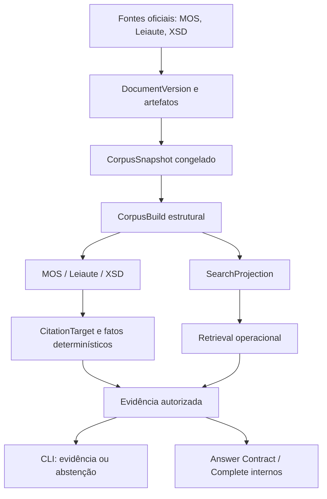

# RAG eSocial

O **RAG eSocial** é uma plataforma local, operada pelo terminal e
*evidence-first*, para consulta estruturada à documentação oficial do eSocial.
O MVP operacional atual recupera e apresenta evidências citáveis do Manual de
Orientação do eSocial (MOS), dos Leiautes e dos schemas XSD, sem reduzir as três
fontes a uma coleção indistinta de trechos de texto.

Cada resultado exibido conserva sua origem documental e seu path citável. A busca
encontra candidatos, mas não os transforma automaticamente em fatos ou respostas.
Quando falta evidência autorizada, o comportamento esperado é abster-se, não
completar lacunas com a memória de um modelo. A arquitetura também contém geração
fundamentada por LLM — incluindo Answer Contract e Complete Mode —, mas essa etapa
ainda não faz parte do fluxo normal de consultas do menu `./esocial`.

## Tecnologias

Python 3.12, PostgreSQL 16 com Full Text Search, SQLAlchemy, Alembic, Typer e Rich compõem o núcleo. Docker Compose e `uv` executam a aplicação e os testes sem instalar Python no host. A imagem PostgreSQL inclui `pgvector`, mas o retrieval operacional atual **não usa vetores nem embeddings**. Há integração opcional com Ollama e `gemma4:12b` para contratos de resposta e avaliações avançadas; o menu normal de evidências não exige que o modelo esteja ligado. Os testes usam pytest e Ruff.

## Início rápido

Pré-requisitos: Docker e o plugin Docker Compose, com o daemon em execução. Não é necessário instalar Python, `uv`, PostgreSQL ou Ollama no host.

Na raiz do repositório:

```sh
./esocial
```

O launcher constrói e inicia os containers, aguarda o banco, aplica migrations e abre o menu. Na primeira execução, sem corpus, o sistema pede **três URLs oficiais**: MOS, pacote XSD e Leiaute principal. Informe URLs atuais obtidas do portal oficial do eSocial; este repositório não fixa URLs de uma versão. Os Anexos I e II do Leiaute são descobertos automaticamente a partir da página principal, com validação determinística.

A preparação baixa e valida os arquivos, calcula hashes, cria e congela um snapshot, materializa as estruturas MOS/Leiaute/XSD, constrói fatos e índices de busca e só então ativa o runtime. Uma interrupção pode ser retomada pelo mesmo launcher. Em execuções seguintes, o corpus ativo é reutilizado; uma atualização de versão oficial é solicitada explicitamente.

Para encerrar, selecione **0. Sair**. Os dados persistidos continuam nos volumes Docker.

## Documentação

O portal completo reúne tutorial, guia operacional, arquitetura, avaliação e
referência: [racascao.github.io/rag_esocial](https://racascao.github.io/rag_esocial/).
Depois do primeiro deploy, ative **Settings → Pages → Build and deployment →
Source: GitHub Actions** no repositório GitHub para publicar pelo workflow.

Para revisar o portal localmente, sem Python no host:

```sh
docker compose run --rm -p 8000:8000 app \
  uv run --group docs mkdocs serve -a 0.0.0.0:8000
```

Abra `http://localhost:8000` (redireciona para `/rag_esocial/`). O build estrito
é `docker compose exec -T app uv run --group docs mkdocs build --strict`.

## Como usar

| Opção | Uso |
| --- | --- |
| **1. MOS** | Orientações, conceitos e procedimentos do manual. |
| **2. Leiaute** | Eventos, grupos, campos, condições e ocorrências. |
| **3. XSD** | Elementos, tipos e restrições dos schemas XML. |
| **4. Evidências cross-source** | Consulta MOS, Leiaute e XSD separadamente. |
| **5. Importar nova versão** | Inicia uma atualização oficial confirmada pelo usuário. |
| **6. Status** | Mostra versões, build, snapshot, revisões e geração do runtime. |
| **0. Sair** | Fecha a sessão interativa. |

Exemplos de perguntas para experimentar após carregar um corpus compatível:

- MOS: “Qual é o conceito do evento S-1000?”; “Qual é o prazo informado para este procedimento?”; “Quem está obrigado?”
- Leiaute: “Quais campos pertencem ao grupo ideEmpregador do S-1000?”; “Qual é a ocorrência e condição do grupo?”; “Qual é o tipo e tamanho do campo nrInsc?”
- XSD: “Quais elementos são filhos de ideEmpregador no XSD do S-1000?”; “Qual é o minOccurs/maxOccurs do elemento?”; “Há enumeração ou pattern para este elemento?”
- Cross-source: “Compare as evidências disponíveis sobre ideEmpregador no MOS, Leiaute e XSD.”

Nem todo atributo existe em toda fonte ou versão. Uma pergunta pode retornar menos evidências que o limite máximo de resultados, ou nenhuma. A opção **4 apresenta evidências por fonte; não produz uma conclusão cross-source**. Síntese operacional entre fontes é uma evolução futura, não uma capacidade implícita deste menu.

## Por que não é apenas um RAG de chunks?

| Abordagem comum de RAG | rag_esocial — MVP operacional |
| --- | --- |
| Documento → chunks → embeddings → top-k → prompt | Fonte versionada → parse estrutural → identidade citável → retrieval determinístico → evidência autorizada → apresentação de evidências ou abstenção |
| Trecho encontrado pode ser tratado como contexto genérico | Retrieval, evidência, resolução de fato e geração têm contratos distintos |
| Posição física pode servir de referência | `CitationTarget` usa identidade estável de origem, não página ou linha |
| Fontes são combinadas no mesmo contexto | MOS, Leiaute e XSD preservam estrutura e autoridade próprias |

O MOS organiza orientações e procedimentos; o Leiaute descreve eventos, grupos, campos e condições; o XSD define estrutura e restrições XML. Não há uma precedência universal: a fonte pertinente depende do tipo de afirmação. Relações exatas e atributos persistidos são preferidos a inferências vagas. Uma divergência entre fontes não deve ser escondida para fabricar consenso.

O sistema conserva `DocumentVersion`, `CorpusSnapshot`, `CorpusBuild`, `SearchProjection` e `ActiveRuntime` para que a versão consultada e a revisão interna sejam identificáveis. Há benchmarks congelados, regressões e isolamento obrigatório do banco de testes. O banco e os artefatos ficam sob controle local do operador. Isso melhora auditabilidade; não é uma promessa de infalibilidade sem revisão humana.

## Arquitetura em resumo



As árvores documentais são independentes. O MOS materializa seções de evento, metadados, tópicos e subitens; o Leiaute materializa eventos, grupos e campos; o XSD, schemas de evento, elementos e tipos compartilhados. Vínculos entre elas só são usados quando podem ser demonstrados deterministicamente. Uma relação XSD de tipo compartilhado não materializada não é inventada pelo retrieval.

### Versões e revisões

- **`DocumentVersion`** identifica uma versão importada de uma fonte oficial.
- **`CorpusSnapshot`** congela o conjunto validado de versões e artefatos.
- **`CorpusBuild`** contém estruturas e fatos derivados de um snapshot por uma revisão de parser.
- **`SearchProjection`** é um índice de busca específico do build e de uma revisão de search.
- **`ActiveRuntime`** aponta para o build/projection prontos para a experiência normal.

Uma **nova versão oficial** cria novo conteúdo e snapshot. Uma **nova revisão do parser** pode exigir novo build sobre snapshot existente. Uma **nova revisão do retrieval** pode criar apenas projections no mesmo build. O estado operacional validado usa `parser-suite-v2` e `fts-baseline-v3`.

### Retrieval operacional atual

O índice usa PostgreSQL Full Text Search e texto lexical autodescritivo. A consulta é analisada deterministicamente para reconhecer códigos S-XXXX, nomes técnicos, atributos estruturais, relações pai/filho e famílias documentais. Escopo por evento e path evita confundir pertencimento estrutural com uma menção textual em outro documento. A busca pode navegar filhos diretos materializados no Leiaute e XSD. `top_k` é um **máximo**, não uma cota preenchida com resultados irrelevantes.

O MVP não utiliza embeddings, busca vetorial, reranker neural, fine-tuning ou reescrita de consulta por LLM. A presença de `pgvector` na infraestrutura não altera essa política. Veja [retrieval operacional v3](docs/operational_retrieval_v3.md) e [UX operacional](docs/operational_ux.md).

### Respostas avançadas e limites

O MVP público entrega retrieval estrutural, evidências citáveis e abstenção. O
repositório também contém infraestrutura avançada de geração fundamentada — Answer
Contract, Complete Mode e Ollama/`gemma4:12b` — com proveniência, validação e
avaliação. Essas interfaces são distintas da opção 4 do menu, e uma resposta
gerada não vira evidência para outra. A evolução prevista para a UX é ligar essa
geração/síntese ao fluxo natural da CLI para oferecer uma resposta final amigável e
citada; ela não é capacidade implícita do menu atual. Quando a estrutura necessária
não está materializada nem pode ser derivada com segurança, o sistema falha fechado.

## Organização do repositório

```text
rag_esocial/     aplicação CLI, parsers, serviços e apresentação
tests/           testes unitários, PostgreSQL e regressões
evaluation/      benchmarks e relatórios versionados
docs/            contratos, decisões e guias técnicos
alembic/         migrations do banco
docker-compose.yaml
esocial          launcher único
README.md
```

## Desenvolvimento e diagnóstico

Build, testes, lint e migrations rodam **dentro dos containers**:

```sh
docker compose up -d --build
docker compose exec -T app uv run ruff check .
docker compose exec -T app uv run ruff format --check .
docker compose exec -T app uv run pytest -q
docker compose exec -T app uv run alembic current
docker compose exec -T app uv run alembic heads
```

Os testes PostgreSQL exigem `ESOCIAL_ENVIRONMENT=test` e operam somente em `esocial_test`; não execute operações destrutivas no banco operacional. Para comandos avançados disponíveis, use `docker compose exec -T app uv run esocial --help`. A configuração de Ollama é opcional para consultas de evidências; os comandos avançados `esocial llm status`, `esocial answer --help` e `esocial eval --help` documentam seus contratos próprios.

Documentação adicional: [estrutura do Leiaute](docs/layout_structure.md), [Answer Contract](docs/answer_contract.md), [avaliação Q14](docs/evaluation_q14.md), [Complete Mode](docs/evaluation_complete_mode.md) e [validação final do MVP](docs/mvp_final_validation.md).

## Princípios de operação

Retrieval não é evidência; evidência precisa ser citável; ausência de suporte leva à abstenção. Snapshots congelados não são modificados. A autoridade depende da fonte e do tipo de afirmação. Nenhum fallback factual automático recorre à memória paramétrica do modelo.
