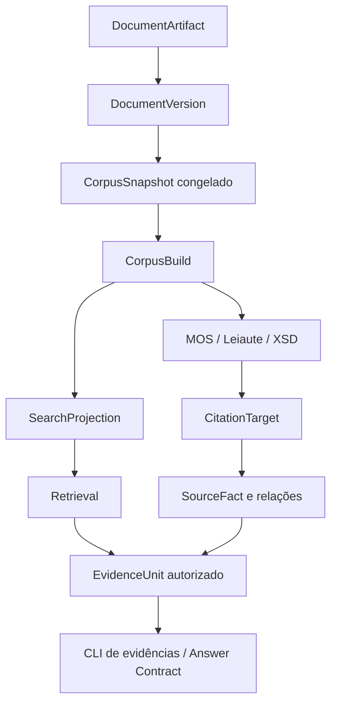

# Visão arquitetural

O sistema preserva o caminho da fonte até a experiência de consulta. Dados
derivados pertencem a um `CorpusBuild`; o runtime aponta atomicamente para um
build e uma projection prontos.

Consulte [ingestão](ingestion.md), [versionamento](versioning.md) e
[runtime](runtime.md) para os contratos de cada etapa.

A CLI operacional do MVP apresenta diretamente a evidência autorizada ou a
abstenção. O Answer Contract representa a infraestrutura avançada de geração
fundamentada, separada desse fluxo público.
