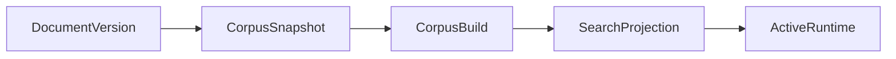

# Versionamento e runtime

`DocumentVersion` representa uma fonte individual; `CorpusSnapshot` congela a
combinação de versões; `CorpusBuild` materializa esse snapshot para uma revisão
de parser; `SearchProjection` é o índice derivado de um build; `ActiveRuntime`
é a ponte atômica da experiência normal.

Uma mudança de parser pode exigir novo build. Uma mudança apenas de retrieval
pode gerar uma projection nova no mesmo build. O histórico ilustra a distinção:
`parser-suite-v1` para `parser-suite-v2` criou build novo; de
`fts-baseline-v2` para `fts-baseline-v3` reutilizou o build e reindexou.
