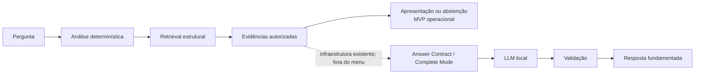

# RAG tradicional e rag_esocial

Um RAG tradicional completo combina recuperação e geração. O rag_esocial foi
arquitetado para esse domínio, mas o fluxo operacional público do MVP ainda
encerra a consulta na apresentação de evidências ou na abstenção. A escolha
estrutural atende ao domínio documental do eSocial, no qual proveniência, versão
e atributos formais importam.

| Aspecto | RAG tradicional completo | rag_esocial — MVP operacional |
| --- | --- | --- |
| Unidade de recuperação | chunk genérico | unidade estrutural persistida |
| Identidade | posição ou chunk | path estável e versão documental |
| Evidência | frequentemente implícita | entidade e autorização explícitas |
| Estrutura | pode ser achatada | evento, grupo, campo, schema e elemento |
| Saída do fluxo | geração a partir do contexto recuperado | apresentação de evidências ou abstenção |
| Ausência de suporte | fallback possível | abstenção contratual |
| Cross-source | concatenação comum | consulta por família e autoridade contextual |
| Versionamento | variável | snapshot, build, projection e runtime |

A arquitetura já contém o ramo de geração fundamentada, com Answer Contract e
Complete Mode. A evolução de UX é conectá-lo de forma amigável à pergunta natural
do usuário, para produzir resposta final citada sem confundir geração com fonte
factual. O MVP usa sinais lexicais e estruturais determinísticos; não usa
embeddings, busca vetorial, reranker neural, fine-tuning ou query rewriting por
LLM.
