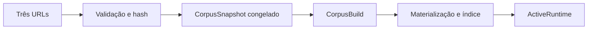

# Primeira execução

Após receber as três URLs principais, o sistema descobre deterministicamente os
Anexos I e II do Leiaute a partir da página principal. Em seguida ele adquire e
valida os arquivos, calcula hashes, cria um snapshot, congela o conjunto,
materializa MOS/Leiaute/XSD, constrói fatos e índices e ativa o runtime somente
quando todas as etapas necessárias terminam.

Falhas não transformam conteúdo parcial em runtime ativo. A recuperação e os
detalhes de atualização estão em [Operação](../operations/lifecycle.md).
