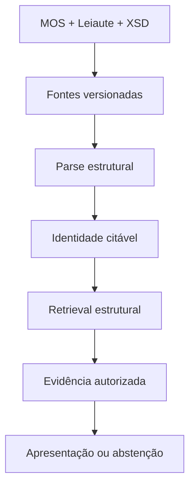

# rag_esocial

O **RAG eSocial** é uma plataforma local *evidence-first* para consulta à
documentação oficial do eSocial. O fluxo operacional do MVP organiza MOS,
Leiaute e XSD como fontes distintas, versionadas e citáveis; ele recupera e
apresenta evidências identificáveis — ou abstém-se quando não houver suporte
autorizado.

O repositório também possui infraestrutura de geração fundamentada com Answer
Contract, Complete Mode e LLM local. Essa geração não integra o menu normal
ainda: a síntese de uma resposta final citada a partir de uma pergunta natural é
uma evolução da experiência pública.

[Começar agora](getting-started/quickstart.md){ .md-button .md-button--primary }
[Guia de uso](user-guide/mos.md){ .md-button }
[Arquitetura](architecture/overview.md){ .md-button }
[Operação](operations/lifecycle.md){ .md-button }

!!! info "Estado do MVP"
    O menu operacional atual recupera e apresenta evidências autorizadas; não
    gera respostas factuais por LLM. A infraestrutura de geração fundamentada
    existe no projeto, mas ainda não está conectada a esse fluxo público.

## Para quem é este portal?

- **Usuários** podem começar pelo [Início rápido](getting-started/quickstart.md)
  e pelo [Guia de uso](user-guide/mos.md).
- **Operadores** encontram ciclo de vida, atualização e recuperação em
  [Operação](operations/lifecycle.md).
- **Desenvolvedores** podem partir de [Evidence-first](concepts/evidence-first.md)
  e seguir para a [Arquitetura](architecture/overview.md).

!!! important
    Retrieval não é evidência. Toda evidência usada pelo sistema precisa ser
    autorizada pelo build ativo e manter uma identidade citável.
