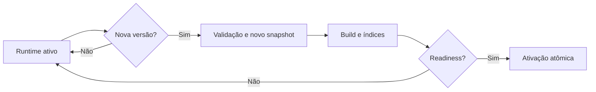

# Ciclo de vida operacional

Uma versão oficial nova é diferente de uma revisão de parser e de uma revisão
de search. O runtime só muda após preparação completa. Snapshots congelados não
são alterados.
