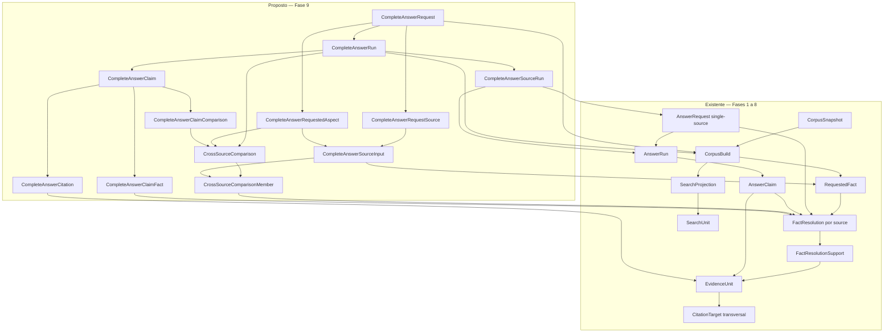

# Fase 9 — arquitetura proposta para Complete Mode

## Estado de implementação

A arquitetura foi aprovada. A subfase 9A está implementada pela migration
`0012_complete_answer` e a 9B pela `0013_cross_source_aggregation`. A 9B
materializa `CrossSourceComparison` e `CrossSourceComparisonMember` com ordem,
revision, digests e vínculos ao mesmo run, source input e `FactResolution`.
Idempotência, nova session, rollback, B1/B2, wrong-build e upstream
immutability estão cobertos em PostgreSQL.

Claims finais, synthesis e renderer interno foram implementados na 9C pela
`0014_complete_synthesis`; benchmark e CLI Complete permanecem reservados à 9D/9E.

## Resultado arquitetural

A recomendação é uma extensão aditiva que orquestra três pipelines single-source
existentes e persiste um contrato final próprio. A Fase 8 permanece a unidade de
execução por fonte. Complete Mode não é um novo fact graph, não faz decomposition
de pergunta e não transforma texto gerado em evidência.

Nomes canônicos propostos:

- `CompleteAnswerRequest`: definição lógica/idempotente do pedido cross-source;
- `CompleteAnswerRequestSource`: source planejada no mesmo build;
- `CompleteAnswerRequestedAspect`: aspecto transversal explicitamente solicitado;
- `CompleteAnswerSourceInput`: binding entre source, aspecto, `RequestedFact` e
  configuração source-local de retrieval/evidence;
- `CompleteAnswerRun`: execução específica do agregado;
- `CompleteAnswerSourceRun`: vínculo da execução agregada a um novo `AnswerRun`;
- `CrossSourceComparison`: resultado determinístico por aspecto/run;
- `CrossSourceComparisonMember`: resolução source-specific comparada;
- `CompleteAnswerClaim`, `CompleteAnswerClaimFact`, `CompleteAnswerCitation` e
  `CompleteAnswerClaimComparison`: resposta final e sua provenance direta.

Esses nomes distinguem o contrato final do `AnswerRequest`, `AnswerRun` e
`AnswerClaim` single-source já existentes.

## Contrato de entrada

Complete Mode recebe estrutura, não apenas linguagem natural:

```json
{
  "corpus_build_id": "...",
  "question": "...",
  "sources": ["MOS", "LAYOUT", "XSD"],
  "aspects": [
    {
      "aspect_key": "event.deadline",
      "subject": {"kind": "EVENT", "key": "S-XXXX"},
      "qualifiers": {},
      "source_inputs": [
        {
          "source": "MOS",
          "requested_fact": {
            "fact_type": "EVENT_PRAZO_DE_ENVIO",
            "subject_kind": "EVENT",
            "subject_key": "S-XXXX",
            "qualifiers": {}
          },
          "profile": "MOS_EVENT_SECTION",
          "query": "S-XXXX prazo",
          "top_k": 5,
          "retrieval_config": {},
          "assembly_config": {}
        }
      ]
    }
  ]
}
```

`aspect_key` é uma chave declarada pelo caller/versioned dataset ou por uma camada
determinística futura aprovada. Ela não é inferida pelo LLM. O subject canonical
ajuda a provar a entidade, mas não substitui o aspecto. Cada source pode ter zero,
um ou vários inputs; cada input escolhe exatamente um profile e configurações
explícitas. Múltiplos inputs podem representar profiles diferentes.

No Complete Mode v1, `sources` contém exatamente `MOS`, `LAYOUT` e `XSD`, uma vez
cada, ainda que alguma não tenha input aplicável ou artefato disponível. Isso torna
ausência observável em vez de omiti-la silenciosamente.

A pergunta é texto de apresentação/geração. A cobertura factual é definida pelos
aspects e RequestedFacts estruturados. Natural-language decomposition/routing fica
fora da Fase 9.

Disponibilidade mínima por source é comprovada pelo snapshot/build:
`MOS_MAIN` para MOS, `LAYOUT_MAIN` para Leiaute e `XSD_PACKAGE` para XSD. Os roles
`LAYOUT_ANNEX_I_DOMAIN_TABLES` e `LAYOUT_ANNEX_II_VALIDATION_RULES` só são exigidos
quando o source input pede fatos dependentes desses anexos. Sua ausência produz um
outcome de availability, não `NO_RELEVANT_EVIDENCE`.

## Fluxo proposto

1. Validar e canonicalizar o input; resolver/criar `RequestedFact` idempotente no
   mesmo `CorpusBuild`.
2. Persistir/reutilizar `CompleteAnswerRequest` e seu plano imutável.
3. Para MOS, Leiaute e XSD, em ordem canônica:
   1. validar disponibilidade da family/roles no snapshot/build;
   2. executar retrieval no profile da própria family;
   3. montar `EvidenceSet` source-local;
   4. resolver `RequestedFact × source`;
   5. reutilizar/criar a definição idempotente `AnswerRequest` single-source;
   6. criar sempre um novo `AnswerRun` daquela source;
   7. persistir `CompleteAnswerSourceRun`.
4. Construir refs agregadas e comparisons deterministicamente a partir de
   `FactResolution`, supports e evidence, sem usar prosa gerada.
5. Se não houver fact `RESOLVED`, finalizar `ABSTAINED`, sem model calls.
6. Se só uma source tiver fatos, promover deterministicamente seus claims válidos
   e links diretos; não chamar synthesis.
7. Se duas ou três sources tiverem fatos, montar o contexto autorizado e chamar o
   synthesis model.
8. Fazer um único retry somente para structured output estruturalmente malformado.
9. Validar schema, allowlists, build/source e a cadeia completa de support.
10. Persistir comparisons e resposta final atomicamente; renderizar por ordem
    determinística.

Mesmo quando um source model falha, seus facts/evidence upstream não deixam de ser
documentais. A recomendação é permitir synthesis sobre esse contexto factual
independentemente validado, excluir integralmente o output inválido e registrar a
falha como limitation que força `PARTIAL`.

## Topologia de model calls

| Situação factual | Source calls | Synthesis calls |
|---|---:|---:|
| nenhuma source com facts | 0 | 0 |
| uma source com facts | 1 | 0 |
| duas sources com facts | até 2 | 1, com um retry estrutural possível |
| três sources com facts | até 3 | 1, com um retry estrutural possível |

Uma source sem nenhum fato autorizado fica `ABSTAINED` e não chama o modelo, como
na Fase 8. Calls source-specific continuam existindo porque são requisito do modo
aprovado e fornecem seções/auditoria por fonte, mas seus textos não alimentam a
synthesis.

Synthesis é permitida somente quando:

- há fatos `RESOLVED` de pelo menos duas families;
- o build é único;
- todos os facts/evidence do contexto passaram no preflight agregado;
- o contexto cabe nos budgets explícitos;
- cada ref foi construída pela aplicação, não pelo provider.

Synthesis é proibida quando não há facts, há apenas uma family factual, existe
mistura de build/source, o budget foi excedido ou o contexto não fecha a cadeia de
support.

## Input factual da synthesis

O modelo recebe uma representação determinística com:

- pergunta;
- source/aspect plan;
- facts resolvidos, seus valores e refs source-qualified;
- conteúdos de `EvidenceUnit` autorizados e suas refs;
- mapa fact → evidence derivado de `FactResolutionSupport`;
- comparisons determinísticas e refs `X1..Xn`;
- limitations/outcomes por source;
- regras do contrato e schema.

Não recebe como base factual:

- texto de `AnswerClaim` source-specific;
- `AnswerRun.rendered_answer` ou raw response;
- `SearchUnit.search_text`;
- fact/resolution não `RESOLVED`;
- evidence não presente no support da resolution;
- interpretação de outro modelo ou conhecimento externo.

## Refs locais source-qualified

Os namespaces são explícitos:

```text
MOS:F1       MOS:E1
LAYOUT:F1    LAYOUT:E1
XSD:F1       XSD:E1
X1           X2
```

O mapping usa ordem fixa de family (`MOS`, `LAYOUT`, `XSD`), ordem do plano de
aspects/inputs e, para evidence, stable path + ID interno apenas como desempate
interno. O prompt e o JSON nunca expõem PK do banco. O mapa completo é persistido
indiretamente nas associações finais.

Refs F/E são válidas apenas no `CompleteAnswerRun` atual. Refs X apontam para
`CrossSourceComparison` persistida no mesmo run.

## Structured output conceitual

```json
{
  "claims": [
    {
      "claim_id": "C1",
      "text": "...",
      "fact_refs": ["MOS:F1", "LAYOUT:F1"],
      "evidence_refs": ["MOS:E1", "LAYOUT:E1"],
      "comparison_refs": ["X1"]
    }
  ]
}
```

O root e cada claim são fechados a propriedades adicionais. IDs são sequenciais,
texto e listas têm limites. `comparison_refs` pode ser vazio; torna-se obrigatório
quando a claim afirma igualdade, diferença ou não comparabilidade cross-source.
Source attribution é derivada das refs, não de texto livre. Limitations e detalhes
de divergence não são escritos pelo modelo: o renderer os anexa a partir do estado
determinístico.

Revisões independentes propostas:

- `complete-answer-contract-v1`;
- `complete-synthesis-prompt-v1`;
- `complete-answer-renderer-v1`;
- `cross-source-comparison-v1`.

O transporte Ollama pode ser reaproveitado, mas o adapter/protocol de synthesis
deve receber schema e configuração próprios. Não se deve alterar silenciosamente
`answer-contract-v1` nem o schema hardwired da Fase 8.

Provider e modelo permanecem Ollama / `gemma4:12b`. A configuração de synthesis é
versionada e digestada separadamente porque prompt, output schema e budget são
diferentes; isso não implica trocar modelo nem alterar a configuração histórica dos
source runs.

## Alinhamento e comparison determinística

### Chave de alinhamento

Uma comparison exige:

1. mesmo `CompleteAnswerRequestedAspect` declarado;
2. mesmo build;
3. subjects iguais por kind/key ou por `CanonicalEntity`/`EntityRelation` D3
   explicitamente autorizada;
4. RequestedFacts ligados ao aspecto pelo plano;
5. facts `RESOLVED` com support válido.

Não há alinhamento fuzzy. A igualdade de `CanonicalEntity` sem igualdade de aspecto
não permite comparar valores. Stable paths provam origem, não equivalência
semântica.

### Comparison kinds

- `SAME_ASPECT_SAME_VALUE`: valores normalizados idênticos no aspecto declarado;
- `SAME_ASPECT_DIFFERENT_VALUE`: valores normalizados diferentes no mesmo aspecto;
- `COMPLEMENTARY`: bindings do mesmo aspecto declaram subaspectos distintos e
  compatíveis; só pode ser usado quando essa relação está no plano/revision;
- `DIFFERENT_ASPECT`: mesma entidade, aspectos declarados diferentes;
- `NOT_COMPARABLE`: falta mapping determinístico suficiente;
- `SINGLE_SOURCE`: apenas uma source resolveu o aspecto.

Somente igualdade/diferença de valores normalizados no mesmo aspecto é puramente
mecânica. `COMPLEMENTARY` depende de uma relação declarada no input/registry, nunca
de julgamento do LLM. `SAME_ASPECT_DIFFERENT_VALUE` é divergência factual
preservada; não escolhe vencedor nem define precedência.

Comparison deve ser persistida porque influencia prompt, validação, renderer,
reprodução e human review. Persistem revision, aspect, kind, normalized value
digests, members e detalhes determinísticos; não persiste interpretação livre como
fato.

Valores estruturados são comparados por JSON canônico. Strings normalizam somente
Unicode NFC, line endings e whitespace periférico; não há case folding, conversão
de unidade ou equivalência semântica implícita. `DIFFERENT_ASPECT` é registrado
como classificação entre bindings de aspects distintos, não como divergência.

## Status algebra

Propõe-se `CompleteAnswerRunStatus` conceitualmente separado, ainda que use os
mesmos valores textuais da Fase 8. Não se altera `AnswerRunStatus`.

- `ANSWERED`: existe ao menos uma final claim; todas as obrigações aplicáveis foram
  resolvidas e source/synthesis outputs usados são válidos. `SOURCE_NOT_APPLICABLE`
  pode aparecer como limitation sem degradar o status.
- `PARTIAL`: existe ao menos uma final claim, mas uma obrigação aplicável ficou
  `ASPECT_NOT_COVERED`, `NO_RELEVANT_EVIDENCE` ou `UNSUPPORTED`, ou ocorreu falha
  source-specific de geração/validação.
- `ABSTAINED`: nenhuma final claim e nenhum fato resolvido em qualquer source; zero
  source-generation e zero synthesis calls.
- `MODEL_ERROR`: havia contexto factual e a synthesis obrigatória falhou no
  provider/timeout ou permaneceu estruturalmente malformada após retry. Não expõe
  resposta final.
- `VALIDATION_FAILED`: a synthesis retornou JSON estruturalmente parseável, mas
  violou schema, allowlist ou support chain. Não expõe resposta final.

Divergence é comparison metadata, nunca status de erro. Uma resposta com coverage
completa e divergência preservada pode ser `ANSWERED`.

Também é necessário um estado operacional distinto do resultado:
`RUNNING`, `FINALIZED`, `FAILED`. `CompleteAnswerRun.status` é anulável enquanto
`RUNNING`; ao finalizar é não nulo. Uma falha interna de persistência deixa
`execution_state=FAILED`, `status=NULL` e failure code auditável, em vez de ser
rotulada incorretamente como erro do modelo.

## Validator cross-source

O validator futuro deve rejeitar, deterministicamente:

1. root/claim com campo desconhecido, tipo, cardinalidade, ordem ou tamanho inválido;
2. claim ID ausente, duplicado ou não sequencial;
3. prefixo fora de `MOS|LAYOUT|XSD` ou ref local inexistente;
4. fact/evidence/comparison ref duplicada;
5. fact que não pertence ao request/source/run atual;
6. `FactResolution` não `RESOLVED`;
7. RequestedFact, resolution, EvidenceSet, EvidenceUnit ou source run de outro build;
8. family da ref diferente da resolution, EvidenceUnit ou CitationTarget;
9. EvidenceUnit não pertencente ao EvidenceSet da resolution;
10. CitationTarget não associada ao build;
11. evidence sem `FactResolutionSupport` para ao menos um fact da mesma claim;
12. claim sem fact ou sem evidence autorizada;
13. source AnswerRun que não está em `CompleteAnswerSourceRun`;
14. source output inválido usado como input factual;
15. comparison ref desconhecida, de outro run/aspect/build ou sem todos os members;
16. claim cross-source que não referencia support de cada source factual afirmada;
17. citation órfã ou PK do banco exposta no payload;
18. context digest diferente do contexto persistido antes da call.

O validator não afirma que o texto é semanticamente entailed nem juridicamente
correto. Essas dimensões ficam para avaliação humana.

## Renderer final

A forma recomendada é “síntese + achados por fonte + comparisons + limitations”:

1. **Resposta consolidada** — claims finais em ordem, com citações inline
   source-qualified;
2. **Por fonte** — achados MOS, Leiaute e XSD, usando os source runs válidos de modo
   conciso e sem repetir integralmente a síntese;
3. **Convergências e divergências** — somente comparisons persistidas;
4. **Limitações** — agrupadas por source e aspecto;
5. **Proveniência operacional** — build/run/revisions em modo inspect, não no texto
   normal.

Quando só uma source é utilizável, claims validados dessa source são promovidos
deterministicamente para entidades finais e recebem links diretos aos mesmos facts
e evidence. Quando todas abstêm, o renderer produz apenas a abstention e limitations.

## Limitações e disponibilidade

Cada `CompleteAnswerSourceRun` registra separadamente:

- availability: `AVAILABLE`, `ARTIFACT_ROLE_UNAVAILABLE`,
  `SOURCE_MATERIALIZATION_UNAVAILABLE`;
- answer run status, quando houve execução;
- RuntimeStatuses por input;
- reason codes e detalhes determinísticos.

Ausência de artifact role não vira `NO_RELEVANT_EVIDENCE`. `SOURCE_NOT_APPLICABLE`
não é ausência de corpus. A renderer sempre exibe ausências relevantes ao plano,
mesmo quando outra source respondeu.

## Modelo de dados proposto



### Por que persistir cada entidade

- request/source/aspect/input: identidade, idempotência e reprodução exata do plano;
- run/source-run: isolamento de execuções probabilísticas e auditoria de falhas;
- comparison/member: preservar a análise determinística que entrou no prompt;
- claim/fact/evidence/comparison links: reconstruir a cadeia factual final;
- rendered answer, raw response, validation summary e provider metadata: reproduzir
  execução, diagnosticar provider e provar o que foi ou não exposto.

Não se persiste novo `SourceFact`, `ResolvedFact`, `EntityRelation` ou
`FactResolution` derivado pelo synthesizer.

## Plano das migrations `0012_complete_answer`, `0013_cross_source_aggregation` e `0014_complete_synthesis`

Somente tabelas novas. Os itens 1–6 foram implementados na 9A e os itens 7–8
na 9B; os itens 9–12 foram implementados na 9C:

1. `complete_answer_requests` — build FK, question/digest, revisions, synthesis
   model/config/digests, request digest, timestamps; unique `(build_id,
   request_digest)`.
2. `complete_answer_request_sources` — request FK, family, source order,
   source-config/digest; PK/unique `(request_id, family)` e `(request_id,
   source_order)`.
3. `complete_answer_requested_aspects` — request FK, aspect key/order, subject
   kind/key, optional canonical entity FK, qualifiers/digest; unique por request/key
   e request/order.
4. `complete_answer_source_inputs` — source-plan FK, aspect FK, RequestedFact FK,
   input order, profile, query/digest, top_k, retrieval/assembly configs e digests;
   unique por source-plan/order.
5. `complete_answer_runs` — request/build FKs, unique run key, operational state,
   nullable semantic status até finalização, provider/model/config, context digest,
   attempts, raw response, rendered answer, validation/comparison summaries,
   failure code, timestamps.
6. `complete_answer_source_runs` — complete run/source-plan FKs, AnswerRequest FK,
   nullable AnswerRun FK somente quando a source ficou indisponível antes de criar
   um request/run, availability/outcomes/order; um `ABSTAINED` zero-call continua
   tendo `AnswerRun` persistido; unique `(complete_run_id, source_plan_id)` e unique
   `answer_run_id` quando não nulo para impedir reutilização entre execuções
   agregadas.
7. **9B**, `cross_source_comparisons` — run FK, aspect FK anulável apenas para
   `DIFFERENT_ASPECT`, key/order/kind/revision, details e value digest; unique por
   run/key e run/order.
8. **9B**, `cross_source_comparison_members` — comparison, source-input e FactResolution
   FKs, family, order, normalized value/digest; PK
   comparison/source-input/resolution e unique order. O source input preserva qual
   aspect binding originou o member.
9. **9C**, `complete_answer_claims` — run FK, key/order/text/hash/state; uniques equivalentes
   à Fase 8.
10. **9C**, `complete_answer_claim_facts` — claim/FactResolution, PK composta.
11. **9C**, `complete_answer_citations` — claim/EvidenceUnit/order, PK composta e unique
    claim/order.
12. **9C**, `complete_answer_claim_comparisons` — claim/comparison, PK composta.

Campos de identidade, ordem, family, digests, revisions, configs e summaries são
não nulos. Raw/rendered/provider metadata, failure details e semantic status durante
`RUNNING` podem ser nulos. Indexar todas as FKs, status/state, `(request_id,
created_at)` e `(run_id, order)`.

Usar `VARCHAR` validado pela aplicação, consistente com as tabelas atuais, em vez
de alterar enums/tipos históricos. FKs para entidades F1–F8 usam `RESTRICT/NO
ACTION`. Children exclusivamente F9 podem usar cascade explícito somente se a
política de exclusão auditável for aprovada; a recomendação conservadora inicial é
`NO ACTION` para todos. Nenhuma coluna, constraint ou enum de
`0011_answer_contract` muda.

PostgreSQL não expressa todas as igualdades transitivas de build/source com as
uniques atuais de 0011. Migration e service devem maximizar FKs locais, mas o
preflight/validator continua obrigatório e falha fechado.

## Transações e recovery

Evitar uma transaction monolítica durante até quatro calls:

1. **request transaction curta:** canonicaliza/persiste request e plano;
2. **uma transaction por source:** retrieval/assembly/resolution e novo source
   `AnswerRun`; cada source válida é commitada independentemente;
3. **aggregation transaction curta:** cria `CompleteAnswerRun` em `RUNNING`, liga
   source runs e persiste um context snapshot/digest;
4. **provider fora de transaction longa:** synthesis usa o snapshot imutável;
5. **finalization transaction:** lock do run, revalidação do context digest,
   comparisons, claims, facts, citations, renderer e `FINALIZED` atomicamente;
6. **failure transaction curta:** registra provider/validation/internal failure sem
   fabricar resposta.

Retry de processo reutiliza o `CompleteAnswerRequest`, mas cria novo
`CompleteAnswerRun` e novos source AnswerRuns. Nunca retoma output probabilístico
parcial como se fosse um run limpo.

## Idempotência e source-run policy

`CompleteAnswerRequest.request_digest` inclui:

- `CorpusBuild.build_digest`;
- pergunta normalizada e digest;
- source set e ordem canônica;
- aspects/subjects/qualifiers ordenados;
- `RequestedFact.request_digest` de cada binding, não PK exposta;
- profile/query/top_k e configs/digests por source input;
- revisions do complete contract, comparison, prompt e renderer;
- synthesis provider/model/config/digest;
- budgets explícitos.

`CompleteAnswerRun` usa run key aleatória e é sempre novo. Uma definição existente
de `AnswerRequest` source-specific é reutilizada idempotentemente, mas um
`AnswerRun` histórico nunca é reutilizado. Isso evita contaminação de experimento e
mantém metadata/latência/output pertencentes à execução agregada atual.

## Rollback contract

O gate PostgreSQL injeta falha na persistência da última
`CompleteAnswerCitation`. Deve provar:

- rollback de todas as claims, fact links, citations, comparison links e rendered
  answer da finalization transaction;
- nenhum final status falso e nenhum child órfão;
- `CompleteAnswerRun` passa a `FAILED` em transaction separada, sem semantic answer
  status e com failure code;
- `CompleteAnswerRequest`, plano e source AnswerRuns já commitados sobrevivem;
- nenhum registro F1–F8 é removido ou alterado;
- uma nova execução pode criar outro run e finalizar normalmente.

Falha antes do commit de uma source reverte somente aquela source transaction. As
demais não são corrompidas, e o source outcome registra a falha quando o agregado é
criado.

## B1/B2 e upstream immutability

Para dois builds do mesmo snapshot:

- `CompleteAnswerRequest(B1) != CompleteAnswerRequest(B2)`;
- runs, source requests/runs, comparisons, claims e links permanecem build-specific;
- qualquer associação B1↔B2 é rejeitada;
- `CitationTarget` e `CanonicalEntity` podem ser compartilhadas por identidade
  transversal já comprovada;
- EvidenceUnit, FactResolution e todos os links finais continuam pertencendo ao
  build do agregado.

O gate de imutabilidade captura antes/depois digest e contagens/hashes de:
`CorpusBuild`, projections/units, evidence sets/units, source/resolved facts,
RequestedFacts, FactResolutions/supports, todos os objetos históricos de Answer
Contract v1, Q14 e reports. Após Complete Mode, somente tabelas F9 e novos runs F8
explicitamente criados pela execução podem crescer; objetos históricos não mudam.

## Failure matrix

`S` é uma tentativa de source-generation quando a source possui facts; `Y` é a
synthesis call inicial. Retry estrutural acrescenta no máximo uma segunda `Y`.

| MOS | Leiaute | XSD | Synthesis | Calls esperadas | Persistência/status | Exposição e limitations |
|---|---|---|---|---:|---|---|
| ANSWERED | ANSWERED | ANSWERED | válida | 3S+1Y | tudo persistido; `ANSWERED` | sim; comparisons visíveis |
| ANSWERED | ANSWERED | ABSTAINED por gap aplicável | válida | 2S+1Y | source abstention + final; `PARTIAL` | sim; gap XSD explícito |
| ANSWERED | NOT_APPLICABLE | NOT_APPLICABLE | não chamada | 1S | promoção determinística; `ANSWERED` | sim; duas N/A informativas |
| MODEL_ERROR | ANSWERED | ANSWERED | válida sobre facts | 3S+1Y | failed source output excluído; `PARTIAL` | sim; erro MOS explícito |
| VALIDATION_FAILED | ANSWERED | ANSWERED | válida sobre facts | 3S+1Y | invalid source output excluído; `PARTIAL` | sim; validation failure explícita |
| ABSTAINED | ABSTAINED | ABSTAINED | proibida | 0 | source outcomes + run; `ABSTAINED` | abstention determinística |
| ANSWERED | ANSWERED divergente | N/A ou ANSWERED | válida | 2–3S+1Y | comparison preservada; status por coverage | sim; sem winner silencioso |
| ANSWERED | ANSWERED | ANSWERED | malformada duas vezes | 3S+2Y | raw/metadata; `MODEL_ERROR` | não |
| ANSWERED | ANSWERED | ANSWERED | timeout | 3S+1Y | failure metadata; `MODEL_ERROR` | não |
| ANSWERED | ANSWERED | ANSWERED | citation não autorizada | 3S+1Y | validation errors; `VALIDATION_FAILED` | não |
| AnswerRun de B1 | source runs B2 | source runs B2 | proibida | 0Y | vínculo rejeitado; execução `FAILED`, status nulo | não; wrong-build diagnostic |

Nos casos de source model failure, “sobre facts” significa facts/evidence upstream
revalidados; nenhum byte do output inválido entra no prompt.

## CLI futura

Preservar `esocial answer generate/show` single-source. Adicionar namespace
discoverable sem mode nullable:

```text
esocial answer complete-generate --build ... --request-file complete_request.json
esocial answer complete-show --run ... [--json] [--inspect]
esocial answer complete-inspect --run ...
esocial eval complete --dataset ... --report ...
```

`complete-generate` recebe o contrato estruturado por arquivo/stdin, não tenta
decompor uma pergunta. `show` exibe resposta; `inspect` detalha request digest,
source runs/statuses, facts/evidence, comparisons, limitations, provider metadata,
tokens/latências e validation summary.

## Evidence e context budgets

Cada `CompleteAnswerSourceInput` explicita `top_k`. O builder aplica, em ordem:

1. facts na ordem do aspect/input;
2. supports na ordem persistida;
3. EvidenceUnits ordenadas por stable path/hash;
4. deduplicação da mesma EvidenceUnit dentro da source;
5. compartilhamento lógico entre facts sem duplicar conteúdo no prompt;
6. caps por fact, source e total em unidades, caracteres e tokens;
7. falha fechada antes do provider quando o mínimo autorizado não cabe.

As configs/caps entram no request/context digest. Não há auto-tuning, reranker,
embeddings ou summarization LLM. Os valores numéricos finais serão calibrados com
corpus representativo; Q14 (máximo observado de 169 prompt tokens por caso) não é
suficiente para defini-los.

## Invariantes do prompt de synthesis

O prompt futuro deve ordenar:

- usar somente facts/evidence enumerados;
- não preencher lacunas com conhecimento externo;
- não citar ref ausente nem criar facts;
- preservar source attribution e divergence material;
- não escolher precedência entre MOS/Leiaute/XSD;
- não transformar `NOT_COMPARABLE` em concordância/contradição;
- não interpretar status negativo como valor;
- produzir exclusivamente o JSON do schema;
- limitar cada claim às refs que realmente a suportam.

Nenhum exemplo benchmark-specific deve entrar no prompt.

## Estratégia de avaliação futura

Q14 permanece congelado e serve apenas como regression single-source. Criar, em
subfase posterior, dataset cross-source próprio, versionado e canonicalizado depois
dos testes fake. Seu tamanho deve resultar da matriz de cobertura, não de número
arbitrário. Deve cobrir ao menos:

- concordância e complementaridade 3-source;
- claims source-specific e multi-source;
- `SOURCE_NOT_APPLICABLE`, `ASPECT_NOT_COVERED`, `NO_RELEVANT_EVIDENCE` e
  `UNSUPPORTED`;
- uma e todas sources abstained;
- divergence determinística e não comparabilidade;
- source generation/validation failure;
- synthesis malformed/timeout/validation failure;
- citation source/build/support incorreta;
- artifact role unavailable;
- B1/B2, rollback e immutability.

Métricas automáticas:

- source execution completeness;
- exact complete-status compliance;
- structured-output valid rate;
- final claim fact/evidence coverage;
- cross-source citation membership validity;
- unauthorized source/fact/evidence/comparison reference rate;
- divergence preservation compliance para gold determinístico;
- abstention/model-call avoidance compliance;
- source omission e expected-source coverage;
- report determinism e canonical serialization.

Não automatizar “correção jurídica”, entailment semântico ou correção da
reconciliação interpretativa. Human review deve registrar:

- legal/domain correctness;
- semantic groundedness;
- completeness;
- qualidade da síntese cross-source;
- preservação de divergence;
- clareza de source attribution;
- reconciliação enganosa/precedência implícita;
- observações e reviewer metadata.

## Matriz de testes da implementação

1. happy path com três sources;
2. mix `ANSWERED/PARTIAL/ABSTAINED`;
3. all-abstained com zero calls;
4. uma única source utilizável, sem synthesis;
5. divergence persistida/renderizada;
6. citation cross-source não autorizada;
7. support/evidence mismatch;
8. prefixo source incorreto/desconhecido;
9. wrong build em cada boundary;
10. source run não pertencente ao Complete request/run;
11. retry único de structured output de synthesis;
12. synthesis `MODEL_ERROR`;
13. synthesis `VALIDATION_FAILED`;
14. idempotência de `CompleteAnswerRequest`;
15. múltiplos `CompleteAnswerRun` com novos source runs;
16. rollback PostgreSQL conforme contrato;
17. B1/B2 com target/entity transversais;
18. upstream immutability;
19. regressão completa da Fase 8 e Q14 byte/canonical intactos;
20. CLI generate/show/inspect;
21. evaluator fake e live;
22. report JSON canônico/reproduzível;
23. availability de artifact/source distinta de no-evidence;
24. Alembic downgrade/upgrade `0012 ↔ 0011`.

## Sequência recomendada de implementação

### 9A — contrato persistente e migration

- entrada: arquitetura aprovada;
- output: models/tabelas request/source/aspect/input/run e associations;
- testes: constraints, idempotência, wrong-build, Alembic round trip;
- gate: nenhum comportamento F8/Q14 muda;
- risco: constraints cross-table insuficientes sem service validation.

### 9B — orchestration e agregação determinística

- entrada: 9A;
- output: source-local execution, refs qualificadas, availability, comparisons e
  context digest;
- testes: três sources, zero-call, single-source, alignment, divergence, B1/B2;
- gate: contexto final contém apenas facts/evidence autorizados;
- risco: budget e classificação de aspects mal especificados.

### 9C — synthesis contract, client, validator e renderer

- entrada: contexto determinístico 9B;
- output: protocolo/schema próprios, retry, final claims/provenance, status algebra;
- testes: negativos completos, malformed/timeout, source failures, renderer;
- gate: toda final claim reconstrói a cadeia até CitationTarget;
- risco: source laundering acidental ou erro semântico não detectável automaticamente.

### 9D — PostgreSQL E2E, rollback, CLI e observabilidade

- entrada: 9A–9C;
- output: generate/show/inspect, transaction/recovery e reports diagnósticos;
- testes: nova session, múltiplos runs, rollback, immutability e regressão total;
- gate: 0012 upgrade/downgrade, Ruff e pytest completos verdes;
- risco: transactions longas ou source runs órfãos sem lifecycle explícito.

### 9E — avaliação fake, canonicalização e live

- entrada: núcleo integralmente verde e budgets medidos;
- output: dataset cross-source, validator/digest, metrics, human review, fake/live
  reports;
- testes: determinismo lógico, canonical report, zero mutation upstream;
- gate: dataset congelado somente após fake completo; live não altera Q14;
- risco: dataset DEV pequeno esconder problemas de corpus/context budget.

Cada subfase só deve receber commit manual se o usuário aprovar essa política. O
Codex não cria commit, push ou tag.

## Decision log

### A. Decisões já fixadas

- model não é source; generation não é validation;
- retrieval, evidence e citation são entidades distintas;
- apenas facts `RESOLVED` com support autorizado chegam a um gerador;
- output intermediário nunca é evidência;
- build/snapshot/provenance são explícitos;
- `CitationTarget` e `CanonicalEntity` mantêm identidade transversal;
- divergence deve ser preservada;
- MOS, Leiaute e XSD executam independentemente antes da composição;
- sem embeddings/reranker/fine-tuning/decomposition nesta fase;
- Q14 v1 e Answer Contract v1 permanecem congelados.

### B. Fatos observados

- F8 é single-source por schema, service e testes;
- request é idempotente e run é execution-specific;
- preflight/validator já provam a cadeia source-local;
- banco não prova sozinho todas as igualdades transitivas;
- não há fact ontology cross-source universal;
- model client atual usa schema F8 fixo;
- transação atual atravessa um model call;
- Q14 live é pequeno frente ao contexto combinado possível.

### C. Recomendações para aprovação

- agregador aditivo e tabelas 9B em `0013_cross_source_aggregation`;
- RequestedAspect explícito no input;
- novos source runs por Complete run;
- facts/evidence/comparisons como único contexto factual de synthesis;
- persistência de comparisons;
- synthesis somente com duas ou mais sources fact-bearing;
- source failure não bloqueia facts upstream, mas força `PARTIAL`;
- `SOURCE_NOT_APPLICABLE` não degrada coverage aplicável;
- transactions curtas e finalização atômica;
- CLI em subcomandos `answer complete-*`.

### D. Questão ainda aberta

- valores numéricos dos budgets por fact/source/total, a medir no corpus oficial
  antes da avaliação live. A política, identidade e comportamento de overflow já
  estão definidos; somente os thresholds dependem de dados ainda não medidos.

## Compatibilidade prometida

Com esta arquitetura, `esocial answer generate/show`, Q14 v1, Answer Contract v1,
`AnswerRunStatus` e migration 0011 continuam sem mudança. A extensão não cria
hierarquia de autoridade documental, não escreve no fact graph e não mistura builds.
Sua persistência/orquestração 9A, agregação determinística 9B e synthesis interna
9C estão implementadas; CLI/recovery/observabilidade 9D permanecem não iniciadas.
